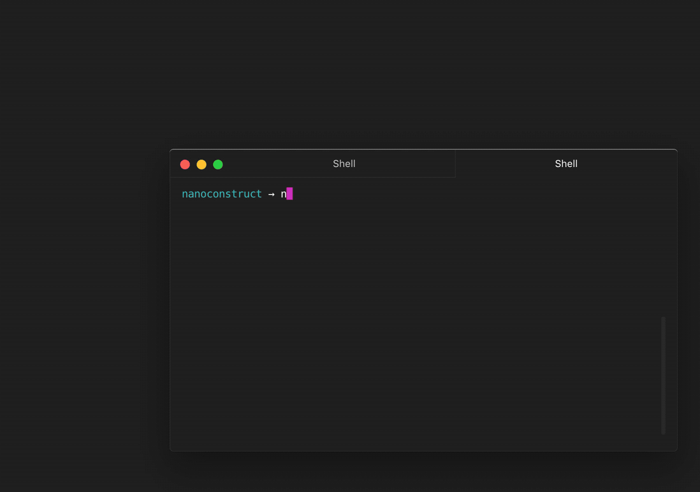

# nanoconstruct
<a href="https://nodejs.org/api/documentation.html#documentation_stability_index">
  
</a>
<a href="https://www.npmjs.com/package/nanoconstruct">
  
</a>

Tiny tool to test and develop [nanocomponents](https://github.com/choojs/nanocomponent).

`nanoconstruct` provides a very simple wrapper around your components and serves them on a simple interface you can access with your browser. It's inspired by [Kit](https://github.com/c8r/kit) and uses [budo](https://github.com/mattdesl/budo) under the hood.

It includes [`choo-devtools`](https://github.com/choojs/choo-devtools), so you have access to the state and other Choo things, and [`tape`](https://github.com/substack/tape) for [testing](#tests).



## Installation
```
npm i nanoconstruct
```

## Usage
If your component depends on a custom state or parameters, you can wrap it into a simple wrapper function. Otherwise, a neutral wrapper will be used around the component.

A simple wrapper function looks like this:
```javascript
var html = require('choo/html')
var Component = require('./components/component')

var c = new Component()

module.exports = () => html`${c.render()}`
```
Then just point `nanoconstruct` to the file with:
```
nanoconstruct example.js
```

### Multiple Components
It's also possible to use your whole component library at once. Use the `--library` mode and point `nanoconstruct` to a directory of wrapper functions or components.

However, if the structure of your components isn't that simple, export all the wrappers or components from a `.js` file and use this as input.

Like this:
```javascript
module.exports = {
  Title: require('./title-wrapper'),
  Content: require('./component/content')
}
```

## CLI
```
usage
  nanoconstruct [opts] <entry>
options
  --help, -h              show this help text
  --library, -l           use all the files from a library
  --open, -o              open the page in the browser
  --port, -p              server port
  --version, -v           print version
examples
  start server
  nanoconstruct example.js

  start server on port 3000 and open it
  nanoconstruct example.js -p 3000 -o

  start server with library mode
  nanoconstruct components --library
```
